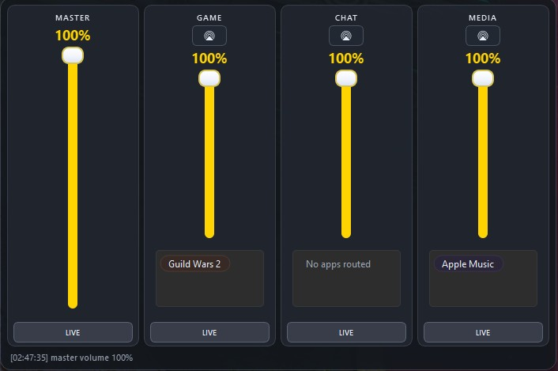

# Sonar Control Panel

Modern PySide6 system-tray flyout mixer for SteelSeries Sonar.



## Highlights

- Tray-first UX (`QSystemTrayIcon`) with flyout mixer panel
- Frameless dark gaming-style UI
- Channels: `MASTER`, `GAME`, `CHAT`, `MEDIA`
- Per-channel volume and mute
- Per-channel output selection (routable channels)
- App routing chips with drag/drop between channels
- Local app alias support (e.g. `Gw2-64` -> `Guild Wars 2`)

## Requirements

- Windows 10/11
- Python 3.11+
- SteelSeries GG / Sonar running

## Installation

```powershell
cd D:\Projects\AudioSwitcher\sonar-control-panel
python -m venv .venv
.\.venv\Scripts\Activate.ps1
python -m pip install -r requirements.txt
```

## Run

```powershell
cd D:\Projects\AudioSwitcher\sonar-control-panel
.\.venv\Scripts\python app.py
```

## Build Installer (Windows)

1. Install Inno Setup 6 (`ISCC.exe` must be available under Program Files).
2. Build app + setup:

```powershell
cd D:\Projects\AudioSwitcher\sonar-control-panel
.\build-installer.ps1 -Version 0.1.0
```

Optional clean build:

```powershell
.\build-installer.ps1 -Version 0.1.0 -Clean
```

Outputs:

- App folder: `dist\SonarMixer\`
- Portable: `dist\SonarMixer-Portable-<version>.zip`
- Installer: `dist\SonarMixer-Setup-<version>.exe`

## CLI Utilities

```powershell
# Capture Sonar/GG IPC probe snapshot
.\.venv\Scripts\python app.py --capture-ipc .\ipc-capture.json

# Replay a captured payload against /v2/subAppActions
.\.venv\Scripts\python app.py --replay-ipc .\payload.json
```

## Project Structure

```text
app.py
requirements.txt
sonar_control/
  application.py       # app orchestration
  ui.py                # flyout UI and widgets
  tray.py              # Qt tray integration
  sonar_client.py      # sonar volume/mute wrapper
  sonar_api_switcher.py# output device selection
  audio_routing.py     # process routing
  assets/              # svg/png icons
```

## Open Source Notes

- License: MIT (see `LICENSE`)
- Contributions: see `CONTRIBUTING.md`
- Keep platform-specific behavior documented in PRs (Windows tray/flyout behavior)
