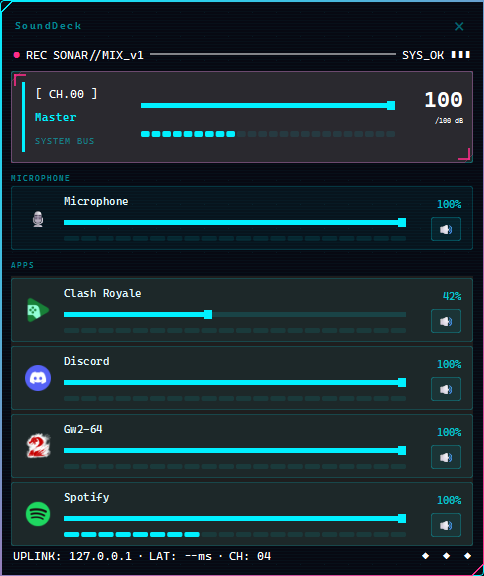
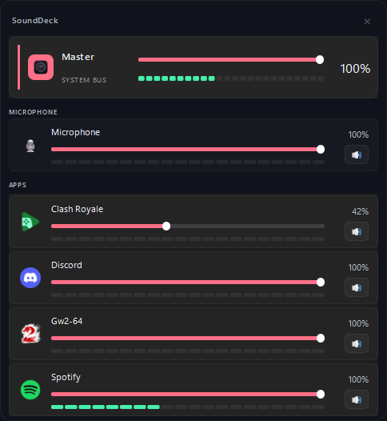

# SoundDeck

A compact Windows **system-tray audio mixer** built with PySide6 — per-app volume, microphone and master control, live meters, and an optional deep integration with SteelSeries Sonar. SteelSeries is **not required**.

<table>
  <tr>
    <td align="center"><b>Cyberpunk theme</b> (default)</td>
    <td align="center"><b>Standard theme</b></td>
  </tr>
  <tr>
    <td></td>
    <td></td>
  </tr>
</table>

## Download

Grab the latest **installer** or **portable** build from the
[Releases page](https://github.com/buracules/sounddeck/releases/latest).

- **Installer** — `SoundDeck-Setup-<version>.exe`
- **Portable** — `SoundDeck-Portable-<version>.zip` (unzip and run `SoundDeck.exe`)

Windows 10/11, 64-bit. The build is unsigned, so SmartScreen may warn on first run — choose *More info → Run anyway*.

## Features

Tray-first UX (`QSystemTrayIcon`) with a frameless flyout panel, a **cyberpunk theme on by default**, live Windows Core Audio VU meters, and a draggable window that grows upward so it never clips off-screen.

**Without SteelSeries** (pure Windows, via `pycaw` — no virtual audio driver needed):

- **Master** output volume/mute
- **Microphone** volume/mute in its own section
- **Per-app mixer** — every running app as a row with its icon, volume slider, live meter, and mute
- Closed apps drop out of the list automatically

**With SteelSeries Sonar running:**

- `MASTER` / `GAME` / `CHAT` / `MEDIA` channels with per-channel volume and mute
- Per-channel output device selection (routable channels)
- Drag-and-drop app routing chips between channels
- Local app alias support (e.g. `Gw2-64` → `Guild Wars 2`)

**Extras:**

- Headset battery badge on the tray icon (SteelSeries Arctis via HID — works even with SteelSeries GG closed)
- Settings window (cyberpunk-styled): theme, compact view, close-on-click-outside, lock window position, status line, launch at startup
- Near-idle CPU usage — audio metering only runs while the flyout is open

## Requirements

- Windows 10/11 (64-bit)
- SteelSeries GG / Sonar — **optional**, enables the 4-channel mixer and per-channel routing

To run from source you also need Python 3.11+.

## Run from source

```powershell
cd sounddeck
python -m venv .venv
.\.venv\Scripts\Activate.ps1
python -m pip install -r requirements.txt
.\.venv\Scripts\python app.py
```

## Build installer (Windows)

1. Install Inno Setup 6 (`ISCC.exe`).
2. Build the portable zip and installer:

```powershell
.\build-installer.ps1 -Version 0.1.9          # add -Clean for a fresh build
```

Outputs land in `dist\`:

- App folder: `dist\SoundDeck\`
- Portable: `dist\SoundDeck-Portable-<version>.zip`
- Installer: `dist\SoundDeck-Setup-<version>.exe`

## Project structure

```text
app.py
requirements.txt
sounddeck/
  application.py         # orchestration, threads, polling
  ui.py                  # flyout UI, channel strips, app rows, settings
  tray.py                # Qt tray integration + battery badge
  sonar_client.py        # Sonar volume/mute wrapper
  sonar_api_switcher.py  # Sonar output device selection
  audio_routing.py       # Sonar per-app routing
  audio_levels.py        # Core Audio peak meters
  headset_battery.py     # Arctis battery over HID
  windows_volume.py      # Windows master + microphone (no Sonar)
  windows_apps.py        # per-app volume/mute mixer (no Sonar)
  assets/                # icons and fonts
```

## Open source notes

- License: MIT (see `LICENSE`)
- Contributions: see `CONTRIBUTING.md`
- Keep platform-specific behavior documented in PRs (Windows tray/flyout behavior)
